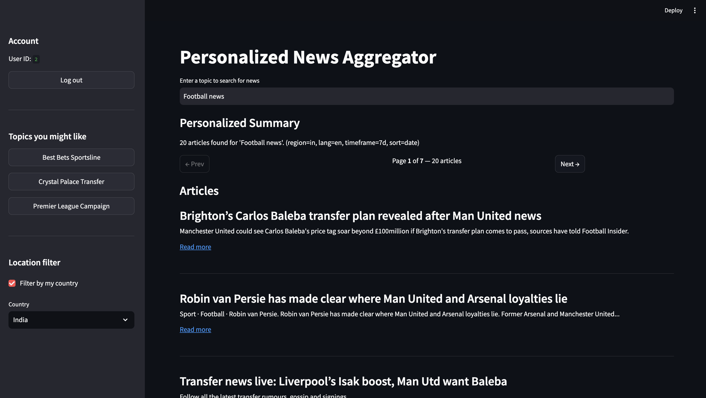

# 📚 Personalized News Aggregator

An intelligent, AI-powered news aggregator that fetches real-time articles based on user queries and preferences, summarizes them using **RAG** (Retrieval-Augmented Generation), and filters them by region, language, and content safety.

---

## 🧠 Features

- ✅ AI Summarization using LLM  
- ✅ Retrieval-Augmented Generation (RAG) pipeline  
- ✅ Full user authentication (Login/Register)  
- ✅ News filtering by country/region & language  
- ✅ Summaries free from headline duplication  
- ✅ Safe content filtering (NSFW / inappropriate detection)  
- ✅ Responsive Streamlit UI with pagination  
- ✅ Personalized topic suggestions  
- ✅ Full backend/frontend integration with Ollama + local vector DB  

---

## 🗂️ Project Structure

```text
project-root/
├── frontend/              # Streamlit frontend app
│   ├── app.py             # Main Streamlit app
│   ├── auth_client.py     # Handles register/login API calls
│   ├── api_client.py      # Talks to backend to get news and summaries
│   ├── topics.py          # Suggests topics based on query/articles
│   ├── safety.py          # Simple client-side content safety check
│   ├── ui.py              # Streamlit UI components (summary, articles)
│   ├── settings.py        # Configurable frontend constants
├── backend/               # Flask or FastAPI backend (assumed)
│   └── ...                # Handles API routing, vector DB, summarization
├── app/                   # Core app logic
│   ├── rag.py             # Full RAG pipeline: index → retrieve → generate
│   ├── content_extractor.py
│   ├── vector_store.py
│   └── ...
```

## Setup Backend

The backend is responsible for fetching full articles, vector indexing, and calling the LLM.

```bash
uvicorn main:app --reload
streamlit run app.py
```

## 🔐 Authentication

- Users can register and log in.  
- Auth token is stored in session state.  
- Logged-in users get personalized suggestions.  

---

## 🌍 Country & Language Filtering

- Choose a country from the sidebar.  
- Region (`us`, `in`, `de`, etc.) and language (`en`, `de`, etc.) are auto-set.  
- When **Filter by my country** is enabled, all searches will respect the selected region/lang.  

---

## 🧠 How Summarization Works

### 🔹 MAP Phase
For each article:
- Title + fulltext is passed to the LLM using a map prompt.  
- Extracts **3–5 key bullet points** (no quotes, no duplication from headline).  

### 🔹 REDUCE Phase
- Combines all bullet points into a **user-personalized summary block**.  
- JSON output includes:
  - Overall summary  
  - Highlights  
  - Top articles with link  

---

## ✨ Smart Display Features

- 🎯 Only shows **3 articles per page**  
- ✅ Each article is summarized below the title  
- 📝 Truncation is avoided; summary block has expanded height  
- 🌐 Summaries only shown in **English**, regardless of source article language  
- 🛡️ NSFW/unsafe content is filtered using a basic client-side check  

---

## 🧱 Backend API Structure
- POST /api/news         # get_news()
- POST /api/summarize    # summarize_batch()
- POST /api/register     # register()
- POST /api/login        # login()

## 🚀 Tech Stack & Tools

### 🧱 Frameworks & Libraries
| Layer         | Tech Used                                         |
| ------------- | ------------------------------------------------- |
| Frontend      | [Streamlit](https://streamlit.io/)                |
| Backend       | [FastAPI](https://fastapi.tiangolo.com/)          |
| API Handling  | `requests`, `httpx`                               |
| Auth          | Custom auth via FastAPI + JWT                     |
| Vector DB     | In-memory (or `ChromaDB`, optional)               |
| LLM Interface | [Ollama](https://ollama.com) (local)              |

---

### 🤖 Large Language Models (LLMs)
| Model     | Provider | Purpose                  |
| --------- | -------- | ------------------------ |
| `mistral` | Ollama   | Main summarization model |
| `llama3`  | Ollama   | Alternative LLM option   |

**Used for:**
- Summarizing individual articles (**MAP**)
- Generating overall summary blocks (**REDUCE**)
- Removing duplication between headlines and content
- Ensuring English-only responses

---

### 🧩 Embeddings
| Component       | Value                                                      |
| --------------- | ---------------------------------------------------------- |
| Model           | `nomic-embed-text`                                         |
| Provider        | Ollama (via `embed_model`)                                 |
| Chunking Method | Fixed length (900 chars) with 150 char overlap             |
| Usage           | Vector similarity for retrieval during summarization (RAG) |

---

## 🔐 Authentication Flow

1. User registers or logs in  
2. Backend returns `user_id` and `token`  
3. Token is stored in `st.session_state`  
4. All backend requests include this token  
5. Search history and topic suggestions are tied to `user_id`  

## 🔄 Flow Diagram

```text
User Query
   ↓
Fetch News Articles (Region + Lang)
   ↓
Full Article → Chunk → Embed → Vector DB
   ↓
Query → Similar Chunks Retrieved
   ↓
MAP: Summarize Each Chunk
   ↓
REDUCE: Combine Summaries + Generate Highlights
   ↓
Display Summary + Top Articles in UI
```
---
## 🧪 Example Prompts (LLM)
### MAP Prompt
```text
You are a concise journalist and summarizer. From the ARTICLE below, write 3–5 bullet points summarizing key insights.

Rules:
- Summarize in **English** only.
- Do NOT repeat phrases or facts from the article title or link.
- Do NOT quote directly or use exact sentences from the article.
- Avoid generic openings. Be specific and insightful.
- Each bullet must be >= 100 words.
- It should be concise and also informative.
- Do not begin with the acronyms

```
### REDUCE Prompt
User preferences: {prefs}
Query: {query}
Synthesize the per-article bullets into a briefing.

Return JSON:
{"summary":"...", "highlights":[ "...", "..."], "top":[{"title":"...","link":"..."}]}
Per-article bullets:
{bullets}
Only return JSON.

## 🧠 LLM and Embeddings Used

### 🔮 Large Language Model (LLM)

- **Model**: `mistral:latest`
- **Provider**: [Ollama](https://ollama.com/)
- **Local API Endpoint**: `http://localhost:11434/api/generate`
- **Used In**: `rag.py` via `_ollama_generate()` function
- **Purpose**:
  - Generate 3–5 bullet summaries per article (`MAP_PROMPT`)
  - Condense multiple article summaries into a personalized summary (`REDUCE_PROMPT`)

> Mistral is an efficient open-weight model that offers fast and accurate performance for summarization tasks. It's served locally via Ollama for low-latency inference.

---

### 🧠 Embeddings

- **Model**: `nomic-embed-text-v1`
- **Provider**: [Nomic AI](https://huggingface.co/nomic-ai/nomic-embed-text-v1)
- **Used In**: `vector_store.py` and `rag.py`
- **Purpose**:
  - Generate dense vector representations of article content chunks
  - Perform similarity-based retrieval of relevant articles from the vector store

---

### 🗂️ Vector Store

- **Library**: `ChromaDB`
- **Persistent Location**: `database/chroma/`
- **Used In**: `vector_store.py`
- **Purpose**:
  - Store vector embeddings of articles by `user_id`, `link`, and `chunk`
  - Query semantically relevant content for user queries
---

These components form the core of the Retrieval-Augmented Generation (RAG) pipeline that powers the intelligent summarization and personalized content delivery.

## 🎥 Watch the Demo

[](https://youtu.be/UvqC-XXiFVE?si=h6UDRc-mNQ0VrChR)
